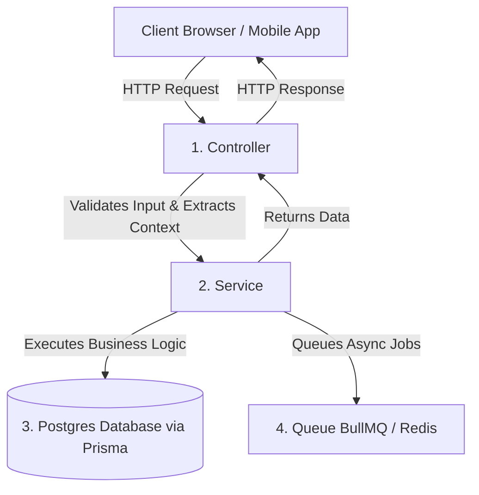

# NestJS Server Template: A Beginner-Friendly Guide

Welcome to the project! This template is a production-ready, enterprise-grade **NestJS server** application. It comes pre-packaged with best practices for database management, authentication, background queuing, caching, and server clustering.

This guide will break down the template in simple terms so you can understand the codebase and start building features confidently.

---

## 1. High-Level Architecture (The Big Picture)

NestJS is a framework for building efficient, scalable Node.js server-side applications. It uses TypeScript by default and is structured similarly to Angular (using modules, controllers, and services).

Think of the application as a series of layers that a request passes through:



1. **Controllers ([src/users/users.controller.ts](file:///c:/Users/coc91/OneDrive/Desktop/CFT/nestjs-server-template/src/users/users.controller.ts))**: These handle incoming HTTP requests (like `GET /users/me` or `POST /users/me/change-password`). They validate input and determine which database or service actions to run.
2. **Services ([src/users/users.service.ts](file:///c:/Users/coc91/OneDrive/Desktop/CFT/nestjs-server-template/src/users/users.service.ts))**: These contain the **business logic**. A service fetches data, checks rules, calculates results, and communicates with the database.
3. **Prisma ORM ([prisma/schema.prisma](file:///c:/Users/coc91/OneDrive/Desktop/CFT/nestjs-server-template/prisma/schema.prisma))**: Instead of writing raw SQL, the application uses Prisma. It defines your database tables and relations in a readable format and generates code to let you query the database easily.

---

## 2. Directory Structure Breakdown

Here is what the major folders and files in the project do:

```yaml
nestjs-server-template/
├── prisma/                   # Database schemas, migrations, and seed scripts
│   ├── schema.prisma         # The blueprint of your database (tables & relations)
│   ├── seed.ts               # Script to pre-populate the database with initial data
│   └── constraints.ts        # Custom script to add database check constraints
├── src/                      # Source code of the application
│   ├── main.ts               # Application entry point (boots up the server & configures middleware)
│   ├── app.module.ts         # Root module of the application (binds other modules together)
│   ├── app.controller.ts     # Global endpoints (like health checks)
│   ├── all-exceptions.filter.ts # Catches and standardizes all error responses
│   ├── app-cache.interceptor.ts # Intercepts requests to cache responses (performance booster)
│   │
│   # Feature Modules (Each folder represents a specific feature area)
│   ├── auth/                 # Registers, logs in users, handles Google OAuth & JWT generation
│   ├── users/                # Fetches profiles, updates profile details, changes passwords
│   ├── mail/                 # Queue-based email sender (uses BullMQ)
│   ├── otp/                  # Generate, send, and verify OTPs (Email/SMS)
│   ├── prisma/               # Exposes the Prisma database client across the app
│   ├── redis/                # Configures the Redis client (used for caching & queues)
│   ├── queue/                # Standardized utility module to create BullMQ queues
│   ├── common/               # Shared decorators, guards, types, base controllers, and utilities
│   ├── configs/              # Configurations for mail, JWT, app settings, loaded from .env
│   ├── metrics/              # Configures Prometheus metrics for system monitoring
│   └── sms/                  # Utility to send SMS messages
│
├── monitoring/               # Configs for monitoring tools (Prometheus & Grafana)
├── templates/                # Pug HTML templates used for emails
├── Dockerfile & docker-compose.yaml # Docker files to containerize the database and backend
└── package.json              # List of dependencies (npm packages) and scripts
```

---

## 3. Core Technologies Explained Simply

### A. Database Management (Prisma)
The database structure is defined in [schema.prisma](file:///c:/Users/coc91/OneDrive/Desktop/CFT/nestjs-server-template/prisma/schema.prisma). 
* **Models**: Models like `Admin`, `User`, `Otp`, and `Setting` represent database tables.
* **Relations**: E.g., `model User` has a relation `meta UserMeta?`, linking a user record to their sensitive/metadata record (Google ID, password hashes).
* **Commands**:
  * `npm run dev:db`: Starts Postgres and Redis containers in Docker for local development.
  * `npm run db:init`: Runs a push to update Postgres schema, applies custom constraints, and seeds the DB with default settings.
  * `npm run db:studio`: Starts a beautiful web interface to view and edit your database records at `http://localhost:5555`.

### B. Authentication & Authorization (Passport / JWT)
To keep endpoints secure, the app uses two security guards:
1. **`JwtAuthGuard`**: Restricts endpoints to logged-in users who supply a valid JSON Web Token (JWT) in their headers (`Authorization: Bearer <token>`).
2. **`AccessGuard`**: Checks if the logged-in user is `Active` or if they have been `Blocked`.
   > [!NOTE]
   > To make the app fast, `AccessGuard` caches the user's status in Redis. It only queries the database once every 5 minutes per user.

We can apply these guards to a whole controller or to specific routes:
```typescript
@UseGuards(JwtAuthGuard, AccessGuard) // Protects all routes inside this controller
@Controller('users')
export class UsersController {
  
  @Roles(UserType.Admin) // Only accessible by administrators
  @UseGuards(RolesGuard)
  @Get()
  async getUsers() { ... }
}
```

### C. Background Tasks & Queues (BullMQ)
Operations like sending an email can take several seconds. Doing this synchronously makes your API feel slow. Instead, this template uses **BullMQ** (powered by Redis) to process tasks in the background.

* **Enqueueing**: In [mail.service.ts](file:///c:/Users/coc91/OneDrive/Desktop/CFT/nestjs-server-template/src/mail/mail.service.ts), the `send()` method puts the email task onto the queue and returns immediately:
  ```typescript
  async send(mailPayload: SendMessagePayload): Promise<void> {
    await this.mailQueue.add('send', mailPayload);
  }
  ```
* **Processing**: In the background, [mail.processor.ts](file:///c:/Users/coc91/OneDrive/Desktop/CFT/nestjs-server-template/src/mail/mail.processor.ts) picks up this task, compiles the Pug email template, and sends it using NodeMailer:
  ```typescript
  async process(job: Job<SendMessagePayload>): Promise<SentMessageInfo> {
    // Compiles template and sends email in the background...
  }
  ```

### D. Safe Configurations (Environment Variable Validation)
When starting up, many apps crash later if a `.env` variable is missing. This template prevents this by validating environment variables on startup.
* [EnvironmentVariables](file:///c:/Users/coc91/OneDrive/Desktop/CFT/nestjs-server-template/src/common/types/index.ts#L24-L63) uses `class-validator` decorators to enforce types (e.g. `@IsInt() PORT: number`, `@IsString() DATABASE_URL`).
* [validate-env.util.ts](file:///c:/Users/coc91/OneDrive/Desktop/CFT/nestjs-server-template/src/common/utils/validate-env.util.ts) runs this check. If you forget to specify a required variable in your `.env` file, the server will refuse to start and tell you exactly what is missing.

---

## 4. Request Lifecycle: Trace a Single Call

Here is a step-by-step trace of what happens when a client calls `PATCH /users/me` to update their profile:

1. **Entry**: The request hits [main.ts](file:///c:/Users/coc91/OneDrive/Desktop/CFT/nestjs-server-template/src/main.ts). Middlewares like `helmet` (security headers), `cookieParser`, and `cors` are applied.
2. **Validation**: The global `ValidationPipe` intercepts the request. It reads the incoming request body and compares it against `UpdateProfileDetailsRequestDto`. If any fields are invalid (e.g. invalid email format), it throws a `400 Bad Request` automatically.
3. **Authentication**: The route hits [users.controller.ts](file:///c:/Users/coc91/OneDrive/Desktop/CFT/nestjs-server-template/src/users/users.controller.ts#L61-L81). It passes through `JwtAuthGuard` (checking the token) and `AccessGuard` (checking user status).
4. **Execution**: The handler `updateProfileDetails()` runs. It extracts the user's ID using `this.getContext(req)` (provided by `BaseController`) and forwards the data to `UsersService`.
5. **Database Interaction**: `UsersService` queries the database via `PrismaService` (`this.prisma.user.update(...)`) to persist the details.
6. **Error Handlers**: If something goes wrong (e.g., database connection fails), `AllExceptionsFilter` catches the error, logs it with `LoggerService`, and returns a clean, uniform JSON error response.
7. **Response**: If successful, it returns `{ status: 'success' }` to the client.

---

## 5. How to Setup and Run for Development

Ready to run it? Follow these 5 steps:

1. **Install dependencies**:
   ```bash
   npm install
   ```
2. **Setup environment variables**:
   Create a `.env` file in the root directory and copy the contents of `example.env` into it. Adjust credentials as needed.
3. **Start Postgres and Redis**:
   Make sure you have Docker Desktop running, then start the databases:
   ```bash
   npm run dev:db
   ```
4. **Initialize database**:
   This runs migrations, sets up database constraints, and seeds default database settings:
   ```bash
   npm run db:init
   ```
5. **Start the NestJS server**:
   Start the server in watch mode (auto-reloads on file changes):
   ```bash
   npm run start:dev
   ```

* Once started, go to `http://localhost:3000/api-spec` (or whichever port is defined in your `.env`) to view the interactive **Swagger OpenAPI Docs**. You can test endpoints directly from there!

---

## 6. Pro-Tips for Your Success
* **Check the CLI**: When building features, run `npm run db:studio` to check your data live.
* **Keep DTOs clean**: Always use `class-validator` decorators in DTO classes to validate user inputs before they reach the service.
* **Use the Logger**: Use `this.logger.info()` or `this.logger.error()` (inherited from `BaseController` or `BaseService`) instead of standard `console.log`. This ensures logs format properly in production.
